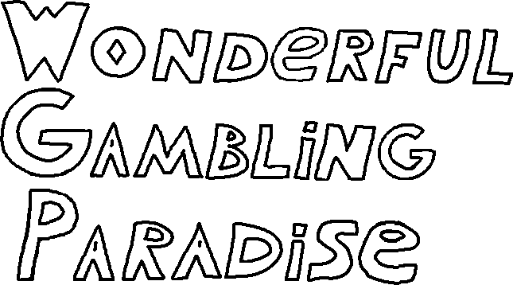

# Wonderful Gambling Paradise

Добро пожаловать на репозиторий проекта игры "Wonderful Gambling Paradise"!

Разработка всё ещё в процессе, и на данном этапе игра имеет версию **Альфа 0.0.4.3**  
Все изменения Вы можете посмотреть в [CHANGELOG.md](development/CHANGELOG.md)

## Attribution
- Игровые механики игры "Trciky Dungeon" вдохновлены игрой "Scoundrel". Авторы: Зак Гейдж и Курт Биг  
- Это фанатская реализация для учебного проекта  
- Весь код - это моя собственная работа

## Dependencies

- **SFML 3.0.2** - Multimedia library ([zlib/png license](https://www.sfml-dev.org/license.php))